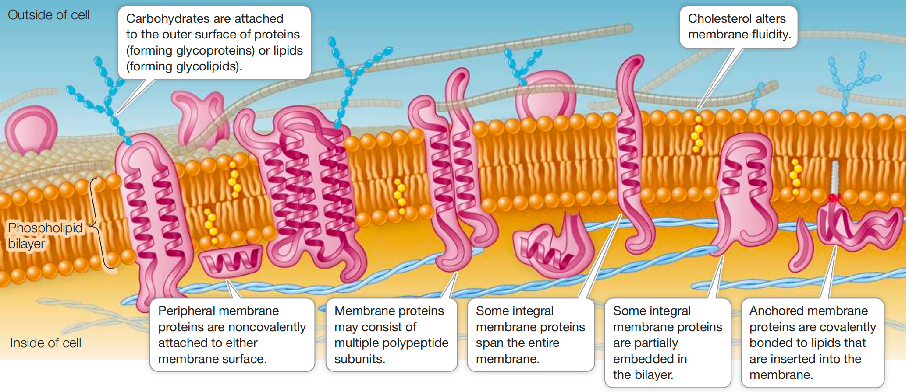

# Chapter 6 Cell Membranes

## 6.1 Biological Membranes

- **fluid mosaic model** 流动镶嵌模型: the phospholipid bilayer serves as a lipid "lake" in which a variety of proteins "float"

  - "mosaid" because it is made up of many discrete components

  - "fluid" because components can move freely

### Lipids form the hydrophobic core of hte membrane

:::{.definition title = "phospholipids 磷脂"} the major lipid components of biological membranes :::

- phospholipids:

  - form thin bilayers

  - with their charged, hydrophilic "heads" on the external surface interacting with the aqueous environment

  - nonpolar, fatty acid "tails" interacting with each other on the inside of hte membrane

- thickness of a biological membrane is about 8nm (\$ \pu{0.0008\mu m} \$), about 2 times of a phospholid \$ \Longrightarrow \$ bilayer

- membranes from different organelles within a cell may vary greatly in their lipid composition, e.g., differ in:

  - fatty acid chain length (number of carbon atoms)

  - degree of unsaturation (number of double bonds) in the fatty acids

  - the polar groups present

{.img-border}

- **Anchored membrane proteins** are [covalently bonded]{.underline} to lipids that are inserted into the membrane.

- **Cholesterol** 胆固醇 alters membrane fluidity

  - The saturated chains allow close packing of fatty acids in the bilayer.

  - The "kinks" 扭结 in unsaturated fatty acids make for a less dense, more fluid packing.

- The **steroid cholesterol** 类固醇 is an abundant component (20%-50%) of animal cell membranes.

  - The hydroxyl group of cholesterol interacts with the polar eneds of phospholipids, and the nonpolar rings and hydrocarbon chain insert into the fatty acids chains in the interior of the membrane.

  - Cholesterol is important for [membrane integrity]{.underline} 完整性 and modulates [membrane fluidity]{.underline}.

  - The cholestrol in your [membranes]{.underline} is not hazardous 有害的 to your health.

::: callout-note
胆固醇本身无问题，但位置和运输方式很重要。

- 在 cell membrane 里， 正常 & 必须

- 在血液里，不溶于水，必须搭乘 **lipoproteins** 脂蛋白运输

  - LDL "bad cholesterol"

  - HDL "good cholesterol"

- LDL $\Uparrow$, 容易把胆固醇沉积到血管壁

  - 时间 $\Uparrow$, atherosclerotic plaques 动脉粥样硬化斑块
:::

- Since spontaneous phospholipid flip-flops are rare, the inner and outer halves of the bilayer may be quite different in the kinds of phospholipids they contain.

- 2 particularly important factors affects [membrane fluidity]{.underline}:

  1.  [Lipid composition]{.underline}:

  - [Cholesterol]{.underline} and [long-chain, saturated fatty acids]{.underline}, pack tightly beside on another, with little room for movement

  - This close packing results in [less fluid membranes]{.underline}.

  - A membrane with [shorter-chain]{.underline} fatty acids, unsaturated fatty acids, or less cholesterol is [more fluid]{.underline}.

  2.  [Temperature]{.underline}

  - At $\Downarrow$ Temperature, molecuels move more slowly and fluidity decreases at reduced temperatures $\Longrightarrow$ cellular processes that take place within the membrane may slow down or stop under cold conditions in organisms that cannot keep their bodies warm.

  - In some organisms the lipid composition of their membranes changes when they get cold, replacing saturated with unsaturated fatty acids and using fatty acids with shorter tails.

  - Theses changes play a role in the survival of plants, bacteria, and hibernating animals during the winter.

### Membrane proteins are asymmetrically distributed

:::{.definition title = "myelin 髓磷脂"}

a modified cell membrane that encloses portions of some neurons (nerve cells) and acts as an electrical insulator

- myelin has only 1 protein for every 70 lipids

:::

- About $\frac{1}{4}$ of the protein-coding genes in the eukaryotic genome encode membrane proteins.

:::{.definition title = "integral membrane proteins 整合膜蛋白"}

一种永久附着在生物膜上的蛋白质（或蛋白组装体）

:::

- **Integral membrane proteins** 整合膜蛋白 are at least partly embedded in the phospholipid bilayer.

- Integral membranes proteins have both [hydrophilic]{.underline} and [hydrophobic]{.underline} regions (domains)

  - [hydrophilic domains]{.underline} 亲水区:

    - stretches of amino acids with hydrophilic side chains (R groups) give certain regions of the protein a [polar character]{.underline}

    - interact with water

    - stick out into the aqueous environment inside or outside the cell or organelle

  - [hydrophobic domains]{.underline} 恐水区:

    - stretches of amino acids with hydrophobic side chains give other regions of the protein a [nonpolar character]{.underline}

    - interact with the fatty acids in the interior of hte phospholipid bilayer, away from water

::: side-arrow-up
:::{.definition title = "peripheral membrane protein 周边膜蛋白"} 一类与细胞膜表面相互作用的蛋白质，不像跨膜蛋白那样穿过脂质双层，而是通过与脂质双层或其他膜蛋白的相互作用而附在膜上。
:::

- **Peripheral membrane proteins** 周边膜蛋白 lack exposed hydrophobic groups.

  - not embedded in the bilayer

  - have polar or charged regions that interact with

    - exposed parts of integral membrane proteins

    - or with the polar heads of phospholipid molecules

- **Anchored membrane protein** 锚定膜蛋白 are covalently attached to fatty acids or other lipid groups.

  - The [hydrophobic lipid groups]{.underline} insert into the phospholipid bilayer and hold these proteins in association with the membrane.

:::{.definition title = "transmembrane protein 跨膜蛋白"}

an integral protein that extends all the way through the phospholipid bilayer and protrudes on both sides

:::

- In addition to having one or more **transmembrane domains** 跨膜区 that [extends all the way through the bilayer]{.underline} such a protein may have [domains with other specific functions]{.underline} on the [inner and outer sides of the membrane]{.underline}.

- [Peripheral membrane proteins]{.underline}, by contrast, are located on [one side of the membrane or the other]{.underline}.

:::

- This asymmetrical arrangement of membrane proteins gives the two surfaces of the membrane different properties.

::: brace-left
- some membrane proteins move around relatively freely within the phospholipid bilayer

- some proteins confined to a specific region of the membrane

  - e.g., like animals at a zoo: the animals are free to move around within the fenced area, but not outside it
:::

### Membranes are constantly changing

- There are major chemical differences amoung the membranes of even a single eukaryotic cell.

### Cell membrane carbohydrates are redognition sites

- A **glycolipid** 糖脂类 consists of a carbohydrate covalently bonded to a lipid.

  - Extending out from the cell surface, the carbohydrate may serve as a [recognition signal]{.underline} for interactions between cells.

  - e.g. The carbohydrates on some glycolipids change when cells become cancerous. This change may allow white blood cells to target cancer cells for destruction.

- A **glycoprotein** 糖蛋白 consists of [one or more short carbohydrate chains]{.underline} [covalently bonded]{.underline} to a [protein]{.underline}.

  - The bound carbohydrates are [oligosaccharides]{.highlight} 寡糖, 低聚糖, usually not exceeding 20 monosaccharide units in length.

  - A [proteoglycan]{.highlight} 蛋白多糖 is a more heavily [glycosylated]{.highlight} 糖基化 protein 蛋白

    - it has [more carbohydrate molecules]{.underline} attached to it

    - the carbohydrate chains are often [longer]{.underline} than they are in glycoproteins.

- The carbohydrates of glycoproteins and proteoglycans often function in [cell recognitnion]{.underline} and [adhesion]{.underline}.

::: brace-left
- [Glycoprotein]{.highlight} = 糖化蛋: 主体是 protein, 上面挂了一些短的 carbohydrate chains

- [Proteoglycan]{.highlight} = 蛋化糖: 主体看起来更像一大坨 carbohydrate, 只有一个 protein core, 上面挂着大量超长的 GAG (glycosaminoglycan) chains
:::

:::{.practice title = "6.1 Recap and Assess"} 1. How do the hydrophobic and hydrophilic regions of phospholipids form a membrane bilayer?

- Hydrophilic heads face the watery environments inside and outside the cell, while hydrophobiic tails point inward away fro mwater, forming a bilayer.

2.  What differentiates an integral protein from a peripheral protein?

- integral proteins are embedded in or span the membrane

- peripheral protein are loosely attached to the membrane surface

3.  If a cell membrane is frozen and then fractured so that the two leaflets of the cell membrane are peeled away from each other, bumps appear in electron microscopy. What are the bumps?

- The bumps are integral membrane proteins embedded within the lipid bilayer.

4.  When a normal lung cell becomes a lung cancer cell, there are several important changes in cell membrane properties. How would you investigate the observation that the cancer cell membrane is more fluid, with more rapid diffusion in the plane of the membrane of both lipids and proteins?

- Use FRAP (fluorescence recovery after photobleaching).

- Label membrane lipids or proteins with fluorescent markers, bleach a small region with a laser, and measure how quickly fluorescence returns.

- Faster recovery in cancer cells would indicate faster lateral diffusion and therefore greater membrane fluidity. :::

::: callout-tip
Q3 讲的是一种叫 freeze-fracture (冷冻断裂) 的观察方法

细胞膜本质上是phospholipid bilayer (磷脂双分子层)

磷脂中间是两层互相面对的 hydrophobic tails, 所以把膜冻住再"掰开"时, 膜很容易从两层磷脂中间裂开:

外侧水环境

O O O O $\Longleftarrow$ hydrophilic heads

| \| \| \|

| O \| O $\Longleftarrow$ integralproteins插在膜里面

| \| \| \|

\_\_\_\_\_\_\_ $\Longleftarrow$ 冻裂时大致从这里分开

| \| \| \|

O O O O

内侧水环境

关键在于: integral membrane proteins 是嵌在 phospholipid bilayer里面的

所以当两层膜被"撕开"以后，有些 integral proteins 会留在其中一层上

用 electron microscopy 看这个被撕开的内部表面时, 它们就会像一个个凸起来的小疙瘩, 也就是题目说的 bumps

所以Q3本质上是在问: "把细胞膜从中间撕开以后, 看到里面有很多凸起, 那是什么?"

答案就是: embedded integral membrane proteins (嵌在膜里的整合膜蛋白)

而 peripheral proteins 主要待在膜表面, 不是嵌在 bilayer 中间, 所以这里看到的 bumps 主要不是它们
:::

------------------------------------------------------------------------

## 6.2 The Cell Membrane Is Important in Cell Adhesion and Recognition
